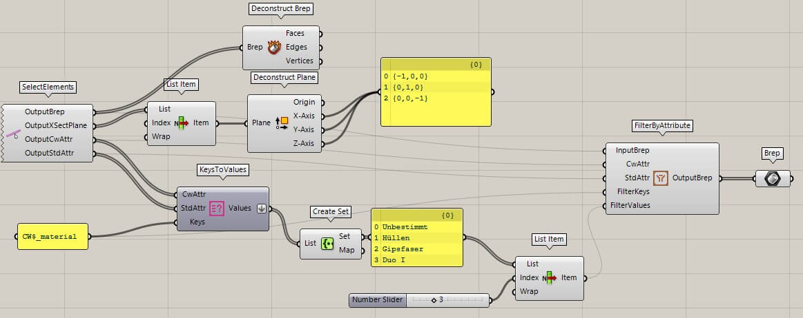

## Select Element(s)

Ein Rechtsklick auf das Icon ruft das Kontext-Menü auf. Mit der Funktion
**Select Elements** können cadwork Brep-Elemente (Stab, Platte, Hilfsvolumen,
Bolzen) sowie 3d/3dc Dateien selektiert und mit Grasshopper verknüpft werden.

{style="width:360px"}

Input  | Beschreibung
:------|:-------------------------------------------
`None` | Elemente via Kontext Menü wählen/hinzufügen

Output           | Beschreibung
:----------------|:---------------------------
`Geometry`       | Geometrie(n) in einer Liste
`XSection`       | Konstruktionsebene
`X-Local-Axis`   | X-Achse
`Z-Local-Axis`   | Z-Achse
`P1`             | Achspunkt 1
`P2`             | Achspunkt 2
`P3`             | Achspunkt 3
`Cw-Attributes`  | User Attribute
`Std-Attributes` | Standard Attribute
`Element-ID`     | Element ID

## Select Surface(s)

Ein Rechtsklick auf das Icon ruft das Kontext-Menü auf. Mit der Funktion
**Select Elements** können Flächen selektiert und mit Grasshopper verknüpft
werden.

{style="width:200px"}

Input  | Beschreibung
:------|:-------------------------------------------
`None` | Elemente via Kontext Menü wählen/hinzufügen

Output           | Beschreibung
:----------------|:-----------------------
`Geometry`       | Elemente in einer Liste
`Cw-Attributes`  | User Attribute
`Std-Attributes` | Standard Attribute
`Element-ID`     | Element ID

## Select Line(s)

Ein Rechtsklick auf das Icon ruft das Kontext-Menü auf. Mit der Funktion
**Select Elements** können Linien selektiert und mit Grasshopper verknüpft
werden.

{style="width:200px"}

Input  | Beschreibung
:------|:-------------------------------------------
`None` | Elemente via Kontext Menü wählen/hinzufügen

Output           | Beschreibung
:----------------|:-----------------------
`Geometry`       | Elemente in einer Liste
`Cw-Attributes`  | User Attribute
`Std-Attributes` | Standard Attribute
`Element-ID`     | Element ID

## Select Node(s)

Ein Rechtsklick auf das Icon ruft das Kontext-Menü auf. Mit der Funktion
**Select Elements** können Knoten selektiert und mit Grasshopper verknüpft
werden.

{style="width:200px"}

Input  | Beschreibung
:------|:-------------------------------------------
`None` | Elemente via Kontext Menü wählen/hinzufügen

Output           | Beschreibung
:----------------|:-----------------------
`Geometry`       | Elemente in einer Liste
`Cw-Attributes`  | User Attribute
`Std-Attributes` | Standard Attribute
`Element-ID`     | Element ID
