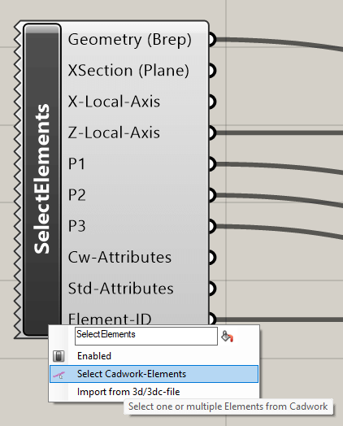

## Select Element(s)

A right click on the icon calls the context menu. With the **Select Elements**
function, cadwork Brep elements (bar, plate, auxiliary volume, bolt) aswell
3d/3dc files can be selected and linked to Grasshopper.

{style="width:360px"}

Input  | Description
:------|:------------------------------------
`None` | Select/add elements via context menu

Output           | Description
:----------------|:------------------
`Geometry`       | Geometry (list)
`XSection`       | Construction plane
`X-Local-Axis`   | X-axis
`Z-Local-Axis`   | Z-axis
`P1`             | axis point 1
`P2`             | axis point 2
`P3`             | axis point 3
`Cw-Attributes`  | User Attribute
`Std-Attributes` | Standard Attribute
`Element-ID`     | Element ID

## Select Surface(s)

Right-clicking on the icon calls up the context menu. With the **Select
Elements** function, surfaces can be selected and linked to Grasshopper.

{style="width:200px"}

Input  | Description
:------|:------------------------------------
`None` | Select/add elements via context menu

Output           | Description
:----------------|:------------------
`Geometry`       | Geometry (list)
`Cw-Attributes`  | User Attribute
`Std-Attributes` | Standard Attribute
`Element-ID`     | Element ID

## Select Line(s)

Right-clicking on the icon calls up the context menu. With the **Select
Elements** function, lines can be selected and linked to Grasshopper.

{style="width:200px"}

Input  | Description
:------|:------------------------------------
`None` | Select/add elements via context menu

Output           | Description
:----------------|:------------------
`Geometry`       | Geometry (list)
`Cw-Attributes`  | User Attribute
`Std-Attributes` | Standard Attribute
`Element-ID`     | Element ID

## Select Node(s)

Right-clicking on the icon calls up the context menu. With the **Select
Elements** function, nodes can be selected and linked to Grasshopper.

{style="width:200px"}

Input  | Description
:------|:------------------------------------
`None` | Select/add elements via context menu

Output           | Description
:----------------|:------------------
`Geometry`       | Geometry (list)
`Cw-Attributes`  | User Attribute
`Std-Attributes` | Standard Attribute
`Element-ID`     | Element ID
