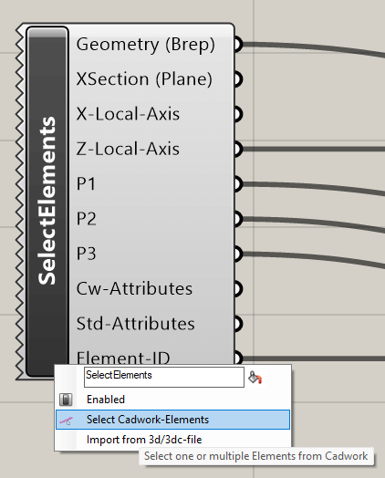
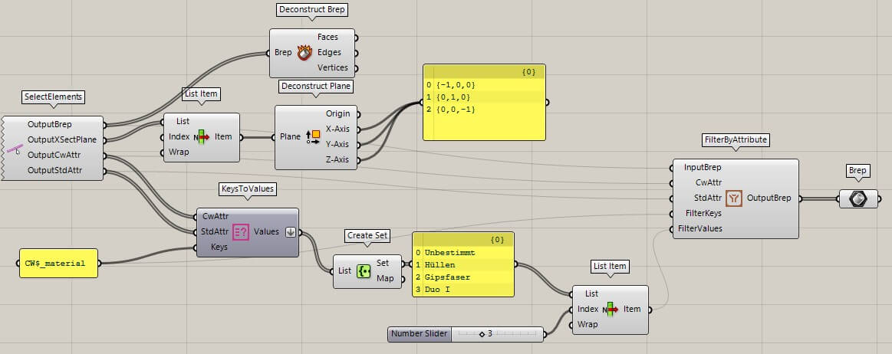
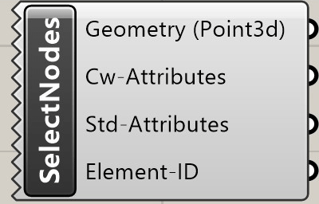

## Select Element(s)

Un clic droit sur l'icône appelle le menu contextuel. La fonction **Select
Elements** permet de sélectionner des éléments cadwork Brep (barre, plaque,
volume auxiliaire, boulon) ainsi que des fichiers 3d/3dc et de les lier à
Grasshopper.

{style="width:360px"}

Input  | Description
:------|:--------------------------------------------------------
`None` | Sélectionner/ajouter des éléments via le menu contextuel

Output             | Description
:------------------|:------------------------
`OutputBrep`       | éléments dans une liste
`OutputXSectPlane` | Restitution du niveau XY
`X-Local-Axis`     | X-axe
`Z-Local-Axis`     | Z-axe
`P1`               | Point d'axe 1
`P2`               | Point d'axe 2
`P3`               | Point d'axe 3
`OutputCwAttr`     | attributs utilisateur
`OutputStdAttr`    | attributs standard
`Element-ID`       | Element ID

## Select Surface(s)

Un clic droit sur l'icône fait apparaître le menu contextuel. La fonction
**Select Elements** permet de sélectionner des surfaces et de les lier à
Grasshopper.

{style="width:200px"}

Input  | Description
:------|:--------------------------------------------------------
`None` | Sélectionner/ajouter des éléments via le menu contextuel

Output          | Description
:---------------|:-----------------------
`OutputSurface` | éléments dans une liste
`OutputCwAttr`  | attributs utilisateur
`OutputStdAttr` | attributs standard
`Element-ID`    | Element ID

## Select Line(s)

Un clic droit sur l'icône fait apparaître le menu contextuel. La fonction
**Select Elements** permet de sélectionner des lignes et de les lier à
Grasshopper.

{style="width:200px"}

Input  | Description
:------|:--------------------------------------------------------
`None` | Sélectionner/ajouter des éléments via le menu contextuel

Output          | Description
:---------------|:-----------------------
`OutputLine`    | éléments dans une liste
`OutputCwAttr`  | attributs utilisateur
`OutputStdAttr` | attributs standard
`Element-ID`    | Element ID

## Select Node(s)

Un clic droit sur l'icône fait apparaître le menu contextuel. La fonction
**Select Elements** permet de sélectionner des nœuds et de les associer à
Grasshopper.

{style="width:200px"}

Input  | Description
:------|:--------------------------------------------------------
`None` | Sélectionner/ajouter des éléments via le menu contextuel

Output          | Description
:---------------|:-----------------------
`OutputNode`    | éléments dans une liste
`OutputCwAttr`  | attributs utilisateur
`OutputStdAttr` | attributs standard
`Element-ID`    | Element ID
