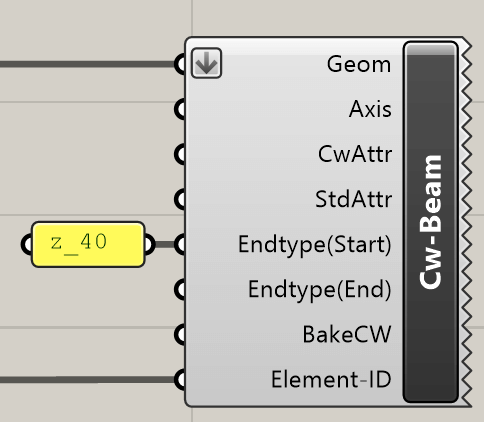
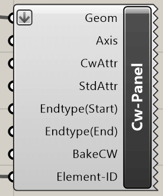
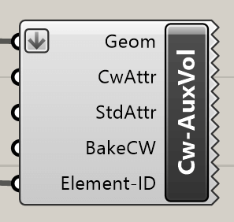
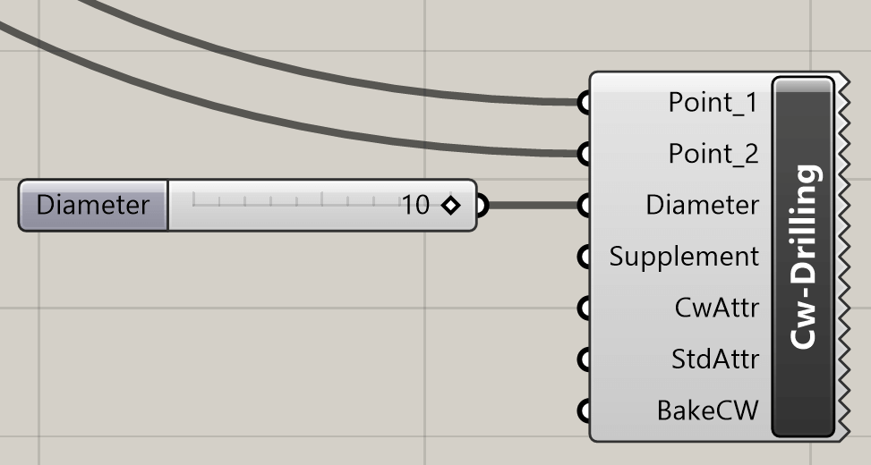
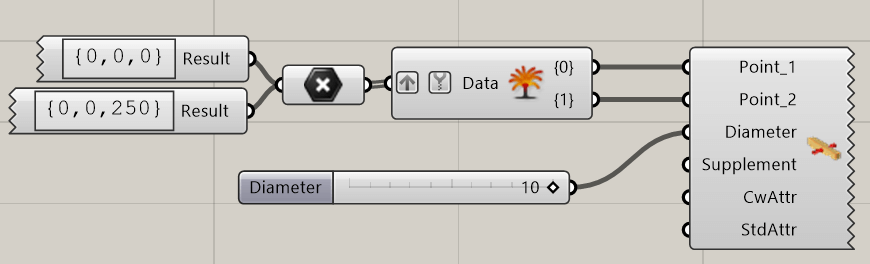
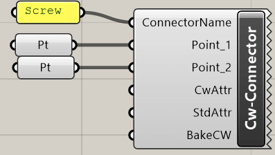
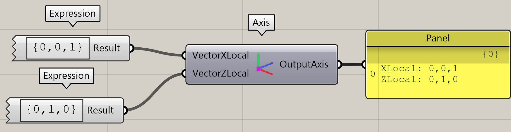

Folgende Komponenten ermöglichen das generieren von cadwork Elementen. Die
Elemente werden als gesperrte Elemente in cadwork dargestellt. Sobald die
Elemente "gebacken" werden, wird die Sperrung aufgehoben. Das Backen erfolgt
über das Kontextmenü.

{style="width:300px"}

**Bake all to cadwork** gibt alle, mit Grasshopper erzeugten Elemente, frei
(Sperrung der Elemente wird aufgehoben).

## Beam

Die Komponente **Cw-Beam** generiert einen Stab in cadwork. Nebst dem
verpflichtenden Geometrie Input, stehen optionale Möglichkeiten zur Verfügung.

{style="width:300px"}

Input            | Beschreibung
:----------------|:-----------------------------------------
`Geom`           | Brep closed
`Axis`           | Achssystem [optional]
`CwAttr`         | User attribute [optional]
`StdAttr`        | Standard attribute [optional]
`Endtype(Start)` | Endtyp Startpunkt Bauteilachse [optional]
`Endtype(End)`   | Endtyp Endpunkt Bauteilachse [optional]
`BakeCW`         | Backen in cadwork [optional]
`ElementID`      | Element ID [optional]

Output | Beschreibung
:------|:---------------------------------
`None` | Element wird in cadwork generiert

Mit einem Rechtsklick auf das Icon kann im Kontext-Menü die Option **Cadwork
Preview, Bake to Cadwork, Bake all to Cadwork** gewählt werden. Oder via Input
BakeCW.

{style="width:410px"}

## Panel

Die Komponente **Cw-Panel** generiert eine Platte in cadwork.

{style="width:210px"}

Input            | Beschreibung
:----------------|:-----------------------------------------
`Geom`           | Brep closed
`Axis`           | Achssystem [optional]
`CwAttr`         | Userattribute [optional]
`StdAttr`        | Standardattribute [optional]
`Endtype(Start)` | Endtyp Startpunkt Bauteilachse [optional]
`Endtype(End)`   | Endtyp Endpunkt Bauteilachse [optional]
`BakeCW`         | Backen in cadwork [optional]
`ElementID`      | Element ID [optional]

Output | Beschreibung
:------|:---------------------------------
`None` | Element wird in cadwork generiert

## Auxiliary Element

Die Komponente **Cw-AuxVol** generiert ein Hilfsvolumen in cadwork.

{style="width:200px"}

Input       | Beschreibung
:-----------|:----------------------------
`Geom`      | Brep closed
`CwAttr`    | Userattribute [optional]
`StdAttr`   | Standardattribute [optional]
`BakeCW`    | Backen in cadwork [optional]
`ElementID` | Element ID [optional]

Output | Beschreibung
:------|:---------------------------------
`None` | Element wird in cadwork generiert

## Drilling

Die Komponente **Cw-Drilling** generiert einen Bolzen in cadwork. Die Komponenten
benötigt als Input einen **Punkt 1, Punkt 2, Durchmesser**. Die **Bohrungszugabe
sowie die Attribute** können optional ergänzt werden.

{style="width:400px"}

{style="width:700px"}

Input        | Beschreibung
:------------|:------------------------------
`Point_1`    | Start Point
`Point_2`    | End Point
`Diameter`   | Durchmesser [mm]
`Supplement` | Zugabe Bohrung [mm] [optional]
`CwAttr`     | User Attribute [optional]
`StdAttr`    | Standardattribute [optional]
`BakeCW`     | Backen in cadwork [optional]

Output | Beschreibung
:------|:---------------------------------
`None` | Element wird in cadwork generiert

## Connector Axis

Die Komponente **Connector Axis** erzeugt eine Standard-Verbindungsmittel-Achse
in cadwork. Die Komponente benötigt als mindest Eingabe einen **vorhandenen
Verbindungsachsennamen, Punkt 1, Punkt 2**.

{style="width:360px"}

Input            | Beschreibung
:----------------|:----------------------------
`Connector Name` | Standard Connector Axis Name
`Point_1`        | Start Point
`Point_2`        | End Point
`CwAttr`         | User Attribute [optional]
`StdAttr`        | Standardattribute [optional]
`BakeCW`         | Backen in cadwork [optional]

Output | Beschreibung
:------|:---------------------------------
`None` | Element wird in cadwork generiert

## Bauteilachsen

Lokale Bauteilachsen werden über die **Axis** Komponente definiert.
Es wird ein X-, sowie ein Z-Vector angegeben.

{style="width:700px"}

Input          | Beschreibung
:--------------|:------------
`VectorXLocal` | {x, y, z}
`VectorYLocal` | {x, y, z}

Output       | Beschreibung
:------------|:--------------------------
`OutputAxis` | Rückgabe der cadwork Ebene

## Fläche erzeugen

Die Komponente **Cw-Surface** generiert eine Fläche in cadwork.

{style="width:160px"}

Input       | Beschreibung
:-----------|:----------------------------
`Geom`      | Surface
`CwAttr`    | Userattribute [optional]
`StdAttr`   | Standardattribute [optional]
`BakeCW`    | Backen in cadwork [optional]
`ElementID` | Element ID [optional]

Output | Beschreibung
:------|:---------------------------------
`None` | Element wird in cadwork generiert

## Linie erzeugen

Die Komponente **Cw-Line** generiert eine Linie in cadwork.

{style="width:160px"}

Input       | Beschreibung
:-----------|:----------------------------
`Geom`      | Line
`CwAttr`    | Userattribute [optional]
`StdAttr`   | Standardattribute [optional]
`BakeCW`    | Backen in cadwork [optional]
`ElementID` | Element ID [optional]

Output | Beschreibung
:------|:---------------------------------
`None` | Element wird in cadwork generiert

## Knoten erzeugen

Die Komponente **Cw-Node** generiert einen Knoten in cadwork.

{style="width:160px"}

Input       | Beschreibung
:-----------|:----------------------------
`Geom`      | Point
`CwAttr`    | Userattribute [optional]
`StdAttr`   | Standardattribute [optional]
`BakeCW`    | Backen in cadwork [optional]
`ElementID` | Element ID [optional]

Output | Beschreibung
:------|:---------------------------------
`None` | Element wird in cadwork generiert
