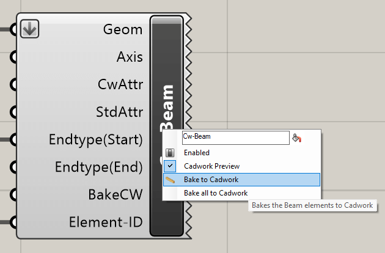
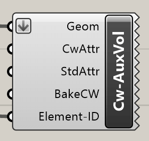

The following components enable the generation of cadwork elements. The elements
are displayed as locked elements in cadwork. As soon as the elements are
"baked", the locking is removed. Baking is done via the context menu.

{style="width:300px"}

**Bake all to cadwork** unlocks all elements created with Grasshopper (unlocks
the elements).

## Beam

The **Cw-Beam** component generates a beam in cadwork. In addition to the mandatory
geometry input, the options **Axis, CwAttr, StdAttr** are optionally available.

{style="width:300px"}

Input            | Description
:----------------|:-------------------------------------------
`Geom`           | Brep closed
`Axis`           | Axis system [optional]
`CwAttr`         | Userattributes [optional]
`StdAttr`        | Standardattributes [optional]
`Endtype(Start)` | Endtype start point element axis [optional]
`Endtype(End)`   | Endtype end point element axis [optional]
`BakeCW`         | bake in cadwork [optional]
`ElementID`      | Element ID [optional]

Output | Description
:------|:-------------------------------
`None` | Element is generated in cadwork

With a right click on the icon the option **Cadwork Preview, Bake to Cadwork,
Bake all to Cadwork** can be selected in the context menu. Or via the input
param BakeCW.

{style="width:410px"}

## Panel

The **Cw-Panel** component generates a panel in cadwork.

{style="width:210px"}

Input            | Description
:----------------|:-------------------------------------------
`Geom`           | Brep closed
`Axis`           | Axis system [optional]
`CwAttr`         | Userattributes [optional]
`StdAttr`        | Standardattributes [optional]
`Endtype(Start)` | Endtype start point element axis [optional]
`Endtype(End)`   | Endtype end point element axis [optional]
`BakeCW`         | bake in cadwork [optional]
`ElementID`      | Element ID [optional]

Output | Description
:------|:-------------------------------
`None` | Element is generated in cadwork

## Auxiliary Element

The **Cw-AuxVol** component generates an auxiliary volume in cadwork.

{style="width:200px"}

Input       | Description
:-----------|:-----------------------------
`Geom`      | Brep closed
`CwAttr`    | Userattributes [optional]
`StdAttr`   | Standardattributes [optional]
`BakeCW`    | bake in cadwork [optional]
`ElementID` | Element ID [optional]

Output | Description
:------|:-------------------------------
`None` | Element is generated in cadwork

## Drilling

The **Cw-Drilling** component generates a bolt in cadwork. The components needs as
input a **Point 1, Point 2, Diameter**. The **Drilling allowance as well as the
attributes** can be added optionally.

{style="width:400px"}

{style="width:700px"}

Input        | Description
:------------|:-----------------------------------
`Point_1`    | Start Point
`Point_2`    | End Point
`Diameter`   | Supplement Drilling [mm]
`Supplement` | supplement diameter [mm] [optional]
`CwAttr`     | Standard Attributes
`StdAttr`    | Standard Attributes
`BakeCW`     | bake in cadwork [optional]

Output | Description
:------|:-------------------------------
`None` | Element is generated in cadwork

## Connector Axis

The **Cw-Connector** component generates a Standard Connector Axis in cadwork.
The components needs as input a **existing connector axis name, Point 1, Point
2**.

{style="width:360px"}

Input           | Description
:---------------|:----------------------------
`ConnectorName` | Standard Connector Axis Name
`Point_1`       | Start Point
`Point_2`       | End Point
`CwAttr`        | Standard Attributes
`StdAttr`       | Standard Attributes
`BakeCW`        | bake in cadwork [optional]

Output | Description
:------|:-------------------------------
`None` | Element is generated in cadwork

## Parts Local Axes

Local component axes are defined via the **Axis** component.
An X vector and a Z vector are specified.

{style="width:700px"}

Input          | Description
:--------------|:-----------
`VectorXLocal` | {x, y, z}
`VectorYLocal` | {x, y, z}

Output       | Description
:------------|:---------------------------
`OutputAxis` | Return of the cadwork plane

## Create Surface

The **Cw-Surface** component generates a surface in cadwork.

{style="width:160px"}

Input       | Description
:-----------|:-----------------------------
`Geom`      | Surface
`CwAttr`    | Userattributes [optional]
`StdAttr`   | Standardattributes [optional]
`BakeCW`    | bake in cadwork [optional]
`ElementID` | Element ID [optional]

Output | Description
:------|:-------------------------------
`None` | Element is generated in cadwork

## Create Line

The **Cw-Line** component generates a line in cadwork.

{style="width:160px"}

Input       | Description
:-----------|:-----------------------------
`Geom`      | Line
`CwAttr`    | Userattributes [optional]
`StdAttr`   | Standardattributes [optional]
`BakeCW`    | bake in cadwork [optional]
`ElementID` | Element ID [optional]

Output | Description
:------|:-------------------------------
`None` | Element is generated in cadwork

## Create Node

The **Cw-Node** component generates a node in cadwork.

{style="width:160px"}

Input       | Description
:-----------|:-----------------------------
`Geom`      | Point
`CwAttr`    | Userattributes [optional]
`StdAttr`   | Standardattributes [optional]
`BakeCW`    | bake in cadwork [optional]
`ElementID` | Element ID [optional]

Output | Description
:------|:-------------------------------
`None` | Element is generated in cadwork
