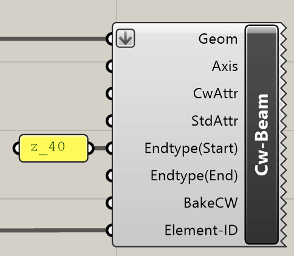
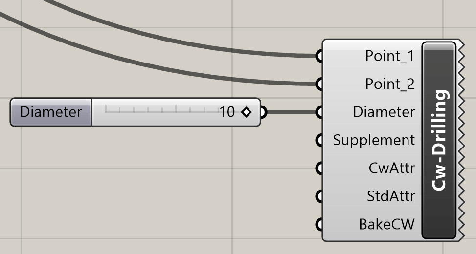
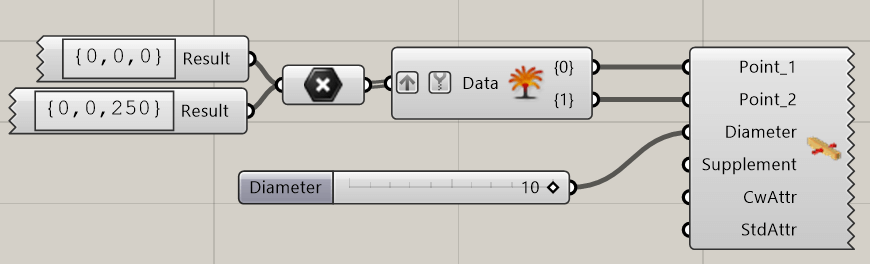
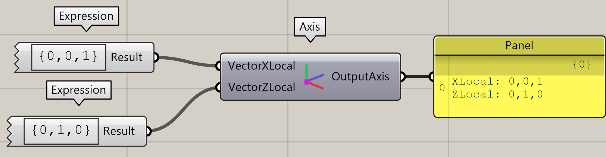

Les composants suivants permettent de générer des éléments cadwork. Les éléments
sont représentés comme des éléments verrouillés dans cadwork. Dès que les
éléments sont "cuits", le verrouillage est levé. La cuisson s'effectue via le
menu contextuel.

{style="width:300px"}

**Bake all to cadwork** libère tous les éléments créés avec Grasshopper (le
verrouillage des éléments est levé).

## Barre

Le composant **Cw-Beam** génère une barre dans cadwork. En plus de l'entrée
géométrique obligatoire, les possibilités **Axis, CwAttr, StdAttr** sont
disponibles en option.

{style="width:300px"}

Input            | Description
:----------------|:------------------------------------
`Geom`           | Brep closed
`Axis`           | Système d'axes [optional]
`CwAttr`         | Userattributes [optional]
`StdAttr`        | Standardattributes [optional]
`Endtype(Start)` | Type extrémité départ axe [optional]
`Endtype(End)`   | Type extrémité final axe [optional]
`BakeCW`         | bake in cadwork [optional]
`ElementID`      | Element ID [optional]

Output | Description
:------|:---------------------------------
`None` | L'élément est généré dans cadwork

Avec un clic droit sur l'icône, on peut sélectionner dans le menu contextuel
l'option **Cadwork Preview, Bake to Cadwork, Bake all to Cadwork**. Cela permet
de lire les axes des composants.

{style="width:410px"}

## Panneau

Le composant **Cw-Panel** génère un panneau dans cadwork.

{style="width:210px"}

Input            | Description
:----------------|:------------------------------------
`Geom`           | Brep closed
`Axis`           | Système d'axes [optional]
`CwAttr`         | Userattributes [optional]
`StdAttr`        | Standardattributes [optional]
`Endtype(Start)` | Type extrémité départ axe [optional]
`Endtype(End)`   | Type extrémité final axe [optional]
`BakeCW`         | bake in cadwork [optional]
`ElementID`      | Element ID [optional]

Output | Description
:------|:---------------------------------
`None` | L'élément est généré dans cadwork

## Volume auxiliaire

Le composant **Cw-AuxVol** génère un volume auxiliaire dans cadwork.

{style="width:200px"}

Input       | Description
:-----------|:-----------------------------
`Geom`      | Brep closed
`CwAttr`    | Userattributes [optional]
`StdAttr`   | Standardattributes [optional]
`BakeCW`    | bake in cadwork [optional]
`ElementID` | Element ID [optional]

Output | Description
:------|:---------------------------------
`None` | L'élément est généré dans cadwork

## Axe de perçage

Le composant **Cw-Drilling** génère un axe de perçage dans cadwork. Le composant
nécessite comme entrée un **point 1, point 2, diamètre**. La **surépaisseur de
perçage ainsi que les attributs** peuvent être ajoutés en option.

{style="width:400px"}

{style="width:700px"}

Input        | Description
:------------|:--------------------------
`Point_1`    | Point de départ
`Point_2`    | Point final
`Diameter`   | Diamètre [mm]
`Supplement` | Apport Alésage [mm]
`CwAttr`     | Standardattributes
`StdAttr`    | Standardattributes
`BakeCW`     | bake in cadwork [optional]

Output | Description
:------|:---------------------------------
`None` | L'élément est généré dans cadwork

## Axe d'assemblage

Le composant **Cw-Connector** crée un axe d'assemblage standard dans
cadwork. Le composant nécessite comme entrée minimale un **nom d'axe de liaison
existant, point 1, point 2**.

{style="width:360px"}

Input            | Description
:----------------|:----------------------------
`Connector Name` | Standard Connector Axis Name
`Point_1`        | Start Point
`Point_2`        | End Point
`CwAttr`         | User Attributes
`StdAttr`        | Standard attributes
`BakeCW`         | bake in cadwork [optional]

Output | Description
:------|:---------------------------------
`None` | L'élément est généré dans cadwork

## Axes des composants

Les axes locaux des composants sont définis par le composant **Axis**.
Un vecteur X ainsi qu'un vecteur Z sont indiqués.

{style="width:700px"}

Input          | Description
:--------------|:-----------
`VectorXLocal` | {x, y, z}
`VectorYLocal` | {x, y, z}

Output       | Description
:------------|:-----------------------------
`OutputAxis` | Restitution du niveau cadwork

## Création d'une surface

Le composant **Cw-Surface** génère une surface dans cadwork.

{style="width:160px"}

Input       | Description
:-----------|:-----------------------------
`Geom`      | Surface
`CwAttr`    | Userattributes [optional]
`StdAttr`   | Standardattributes [optional]
`BakeCW`    | bake in cadwork [optional]
`ElementID` | Element ID [optional]

Output | Description
:------|:---------------------------------
`None` | L'élément est généré dans cadwork

## Création d'une ligne

Le composant **Cw-Line** génère une ligne dans cadwork.

{style="width:160px"}

Input       | Description
:-----------|:-----------------------------
`Geom`      | Line
`CwAttr`    | Userattributes [optional]
`StdAttr`   | Standardattributes [optional]
`BakeCW`    | bake in cadwork [optional]
`ElementID` | Element ID [optional]

Output | Description
:------|:---------------------------------
`None` | L'élément est généré dans cadwork

## Création d'un noeud

Le composant **Cw-Node** génère un noeud dans cadwork.

{style="width:160px"}

Input       | Description
:-----------|:-----------------------------
`Geom`      | Point
`CwAttr`    | Userattributes [optional]
`StdAttr`   | Standardattributes [optional]
`BakeCW`    | bake in cadwork [optional]
`ElementID` | Element ID [optional]

Output | Description
:------|:---------------------------------
`None` | L'élément est généré dans cadwork
