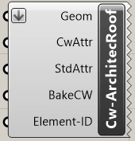
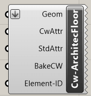
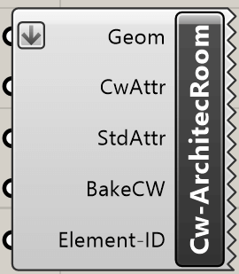

Mit den Architektur Komponenten lassen sich in cadwork Architekturelemente
erstellen. Die Komponenten benötigen als Input eine Geometrie. Die Attribute
können optional ergänzt werden.

## Dach

{style="width:160px"}

Input       | Beschreibung
:-----------|:----------------------------
`Geom`      | Brep closed
`CwAttr`    | Userattribute [optional]
`StdAttr`   | Standardattribute [optional]
`BakeCW`    | Backen in cadwork [optional]
`ElementID` | Element ID [optional]

Output | Beschreibung
:------|:---------------------------------
`None` | Element wird in cadwork generiert

## Wand

{style="width:160px"}

Input       | Beschreibung
:-----------|:----------------------------
`Geom`      | Brep closed
`CwAttr`    | Userattribute [optional]
`StdAttr`   | Standardattribute [optional]
`BakeCW`    | Backen in cadwork [optional]
`ElementID` | Element ID [optional]

Output | Beschreibung
:------|:---------------------------------
`None` | Element wird in cadwork generiert

## Decke

{style="width:160px"}

Input       | Beschreibung
:-----------|:----------------------------
`Geom`      | Brep closed
`CwAttr`    | Userattribute [optional]
`StdAttr`   | Standardattribute [optional]
`BakeCW`    | Backen in cadwork [optional]
`ElementID` | Element ID [optional]

Output | Beschreibung
:------|:---------------------------------
`None` | Element wird in cadwork generiert

## Raum

{style="width:160px"}

Input       | Beschreibung
:-----------|:----------------------------
`Geom`      | Brep closed
`CwAttr`    | Userattribute [optional]
`StdAttr`   | Standardattribute [optional]
`BakeCW`    | Backen in cadwork [optional]
`ElementID` | Element ID [optional]

Output | Beschreibung
:------|:---------------------------------
`None` | Element wird in cadwork generiert
