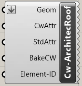
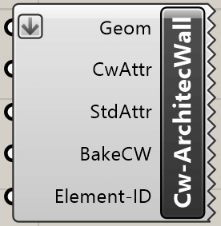
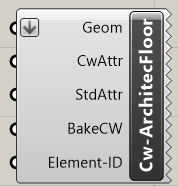
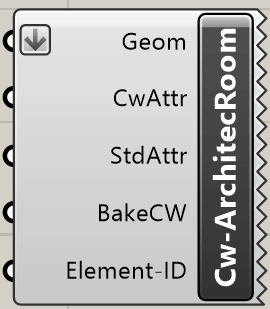

With the architecture components architectural elements can be created in
cadwork. The components need a geometry as input. The attributes can be added
optionally.

## Roof

{style="width:160px"}

Input       | Description
:-----------|:-----------------------------
`Geom`      | Brep closed
`CwAttr`    | Userattributes [optional]
`StdAttr`   | Standardattributes [optional]
`BakeCW`    | bake in cadwork [optional]
`ElementID` | Element ID [optional]

Output | Description
:------|:-------------------------------
`None` | Element is generated in cadwork

## Wall

{style="width:160px"}

Input       | Description
:-----------|:-----------------------------
`Geom`      | Brep closed
`CwAttr`    | Userattributes [optional]
`StdAttr`   | Standardattributes [optional]
`BakeCW`    | bake in cadwork [optional]
`ElementID` | Element ID [optional]

Output | Description
:------|:-------------------------------
`None` | Element is generated in cadwork

## Floor/Slab

{style="width:160px"}

Input       | Description
:-----------|:-----------------------------
`Geom`      | Brep closed
`CwAttr`    | Userattributes [optional]
`StdAttr`   | Standardattributes [optional]
`BakeCW`    | bake in cadwork [optional]
`ElementID` | Element ID [optional]

Output | Description
:------|:-------------------------------
`None` | Element is generated in cadwork

## Room

{style="width:160px"}

Input       | Description
:-----------|:-----------------------------
`Geom`      | Brep closed
`CwAttr`    | Userattributes [optional]
`StdAttr`   | Standardattributes [optional]
`BakeCW`    | bake in cadwork [optional]
`ElementID` | Element ID [optional]

Output | Description
:------|:-------------------------------
`None` | Element is generated in cadwork
