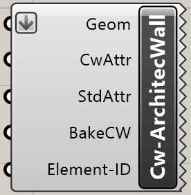

Les composants d'architecture permettent de créer des éléments d'architecture
dans cadwork. Les composants ont besoin d'une géométrie comme entrée. Les
attributs peuvent être complétés en option.

## Toit

{style="width:160px"}

Input       | Description
:-----------|:----------------------------
`Geom`      | Brep closed
`CwAttr`    | Userattribute [optional]
`StdAttr`   | Standardattribute [optional]
`BakeCW`    | bake in cadwork [optional]
`ElementID` | Element ID [optional]

Output | Description
:------|:---------------------------------
`None` | L'élément sera créé dans cadwork

## Paroi

{style="width:160px"}

Input       | Description
:-----------|:----------------------------
`Geom`      | Brep closed
`CwAttr`    | Userattribute [optional]
`StdAttr`   | Standardattribute [optional]
`BakeCW`    | bake in cadwork [optional]
`ElementID` | Element ID [optional]

Output | Description
:------|:---------------------------------
`None` | L'élément sera créé dans cadwork

## Plancher

{style="width:160px"}

Input       | Description
:-----------|:----------------------------
`Geom`      | Brep closed
`CwAttr`    | Userattribute [optional]
`StdAttr`   | Standardattribute [optional]
`BakeCW`    | bake in cadwork [optional]
`ElementID` | Element ID [optional]

Output | Description
:------|:---------------------------------
`None` | L'élément sera créé dans cadwork

## Pièce

{style="width:160px"}

Input       | Description
:-----------|:----------------------------
`Geom`      | Brep closed
`CwAttr`    | Userattribute [optional]
`StdAttr`   | Standardattribute [optional]
`BakeCW`    | bake in cadwork [optional]
`ElementID` | Element ID [optional]

Output | Description
:------|:---------------------------------
`None` | L'élément sera créé dans cadwork
