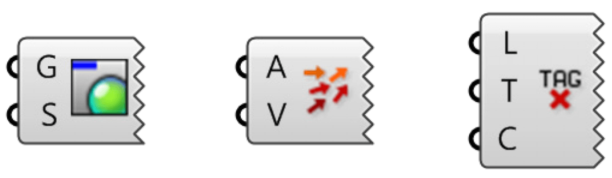

# Welcome to Rhino.Inside cadwork

Rhino.Inside cadwork is a tool that allows you to embed Rhino 7 in cadwork 3D.
Take advantage of the surface modeler in your cadwork 3D environment.

## Add-on Download

[food4Rhino - Rhino.Inside
cadwork](https://www.food4rhino.com/en/app/rhinoinside-cadwork-3d?lang=en)

Food4Rhino is McNeel's community service for plug-ins. Users can find the latest
Rhino plug-ins, Grasshopper add-ons, scripts and much more. Moreover, they can
contact developers and share their applications.

<iframe width="560" height="315" src="https://www.youtube.com/embed/vBh1UHg6ZHQ"
        title="YouTube video player" frameborder="0"
        allow="accelerometer; autoplay; clipboard-write; encrypted-media; gyroscope; picture-in-picture"
        allowfullscreen></iframe>

## Grasshopper

Grasshopper is a graphical algorithm editor that integrates with Rhino3D
modeling tools. You use Grasshopper to design algorithms that then automate
tasks in Rhino3D. Grasshopper's visual "plug-and-play" style gives designers the
ability to combine creative problem solving with novel control systems through
the use of a fluid graphical interface.

{style="width:500px"}

1 The three input parameters of the Circle
CNR component.

2 The circle CNR component area.

3 The output parameter of the Circle CNR
component.

A component needs data to perform its actions, and it usually produces a result.
For this reason, most components have a set of nested parameters called inputs
and outputs, respectively. The input parameters are on the left side, and the
output parameters are on the right side.

There are a few Grasshopper components that have inputs but no outputs, or vice
versa. If a component has no inputs or outputs, it has a jagged edge.

{style="width:360px"}

## Run Rhino.Inside cadwork

Rhino.Inside cadwork is started via **Extra -> Rhino Live Link**.

## Components

The components are divided into four sections:

- The **Attributes** section contains components for handling attributes.

- In the **Select** section you will find all components for selecting cadwork
  elements.

- In the **Create Elements** section you can find the components for creating
  cadwork elements.

- The last section **Architecture** contains components for creating
  architectural elements.

### Context menu

Some components offer functionalities via the context menu. The context menu is
called up by right-clicking on the icon.

Via the context menu you can

- Select Cadwork Elements or 3d/3dc
- Start the preview
- Bake Elements

