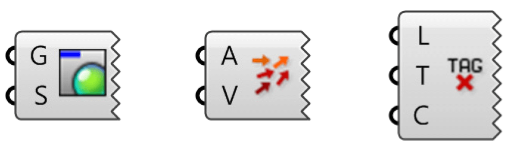
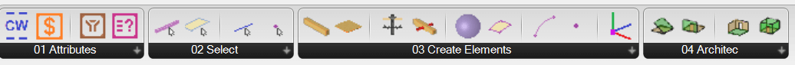

# Bienvenue dans Rhino.Inside cadwork

Rhino.Inside cadwork est un outil qui permet d'intégrer Rhino 7 dans cadwork 3D.
Profitez des avantages du modeleur de surface dans votre environnement cadwork
3D.

## Add-on Download

[food4Rhino - Rhino.Inside
cadwork](https://www.food4rhino.com/en/app/rhinoinside-cadwork-3d?lang=fr)

Food4Rhino est le service communautaire de McNeel pour les plug-ins. Les
utilisateurs y trouvent les derniers plug-ins de Rhino, des modules
complémentaires de Grasshopper, des scripts et bien plus encore. Ils peuvent
également prendre contact avec les développeurs et partager leurs applications.

<iframe width="560" height="315" src="https://www.youtube.com/embed/vBh1UHg6ZHQ"
        title="YouTube video player" frameborder="0"
        allow="accelerometer; autoplay; clipboard-write; encrypted-media; gyroscope; picture-in-picture"
        allowfullscreen></iframe>

## Grasshopper

Grasshopper est un éditeur graphique d'algorithmes intégré aux outils de
modélisation de Rhino3D. Vous utilisez Grasshopper pour concevoir des
algorithmes qui automatisent ensuite des tâches dans Rhino3D. Le style visuel
"plug-and-play" de Grasshopper donne aux concepteurs la possibilité de combiner
des solutions créatives aux problèmes avec des systèmes de règles inédits en
utilisant une interface graphique fluide.

{style="width:500px"}

1 Les trois paramètres d'entrée du composant
Circle CNR.

2 Le cercle des composants CNR.

3 Le paramètre de sortie du composant Circle
CNR.

Un composant a besoin de données pour pouvoir effectuer ses actions, et il
fournit généralement un résultat. C'est pourquoi la plupart des composants ont
une série de paramètres imbriqués, appelés entrées ou sorties. Les paramètres
d'entrée se trouvent sur le côté gauche, les paramètres de sortie sur le côté
droit.

Il existe quelques rares composants de Grasshopper qui ont des entrées mais pas
de sorties, ou l'inverse. Si un composant n'a ni entrées ni sorties, il a un
bord dentelé.

{style="width:360px"}

## Run Rhino.Inside cadwork

Rhino.Inside cadwork est lancé via **Extra -> Rhino Live Link**.

## Composants

Les composants sont divisés en quatre sections&nbsp;:

- Dans la section **Attributs** se trouvent des composants pour la manipulation
  des attributs.

- Dans la section **Select** vous trouverez tous les composants pour la
  sélection d'éléments cadwork. 

- Dans la section **Create Elements**, on trouve les composants pour la création
  d'éléments cadwork.

- Dans la dernière section **Architecture**, on trouve des composants pour la
  création d'éléments d'architecture.

### Menu contextuel

Certains composants proposent des fonctionnalités via le menu contextuel. Le
menu contextuel est appelé par un clic droit sur l'icône.

Le menu contextuel permet de

- Sélectionner des éléments ou 3d/3dc Cadwork
- Lancer un aperçu
- Créer des éléments

